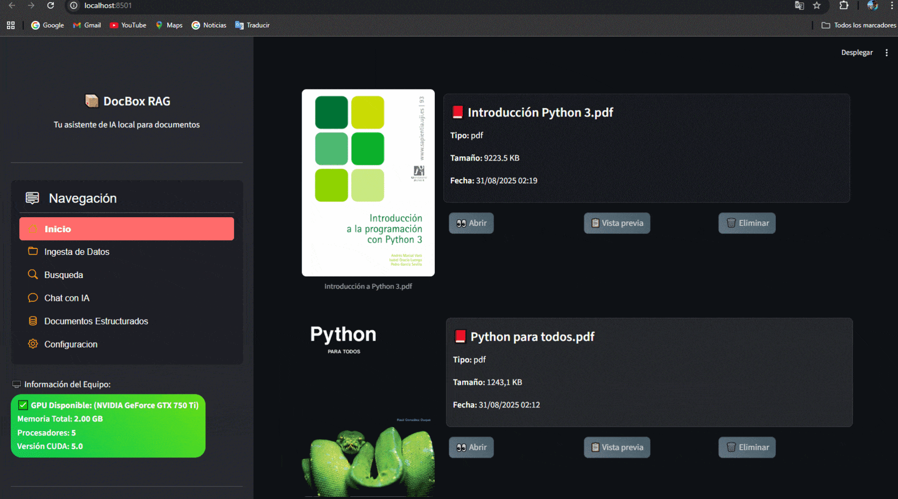

# Document Organizer 🗂️
Una aplicación de escritorio 100% local para organizar, buscar y analizar documentos con inteligencia artificial integrada. Desarrollada en Python con StreamLit para la interfaz gráfica.





## ✨ Características
- **🔍 Búsqueda semántica**: Encuentra documentos por significado, no solo por palabras clave.
- **🌎 Soporte multiplataforma**: Funciona en Windows, macOS y Linux.
- **🏠 100% local**: Todo el procesamiento se realiza en tu equipo, sin conexión a internet.
- **🔏 Privacidad total**: Tus documentos nunca salen de tu ordenador.
- **📖 Formatos soportados**: PDF, DOCX/DOC, XLSX/XLS, TXT, EPUB.
- **🤖 IA integrada**: Puedes usar modelos de lenguaje local para responder preguntas.
- **💻 Interfaz intuitiva**: Fácil de usar con una interfaz moderna y responsive.

## 🚀 Instalación
### Requisitos previos
- Python 3.12 o superior
- pip (gestor de paquetes de Python)
### Pasos de instalación
1. **Clona o descarga el proyecto**:
```bash
git clone https://github.com/Charran78/docubox.git
cd docubox
```
2. **Crea un entorno virtual** (recomendado):
```bash
python -m venv venv
source venv/bin/activate  # Linux/macOS
venv\Scripts\activate     # Windows
```
3. **Instala las dependencias**:
```bash
pip install -r requirements.txt
```
4. **Ejecuta la aplicación**:
```bash
streamlit run app/main.py
```
## 🧠 Uso de IA Local (Opcional)
Para activar la funcionalidad de IA:
1. **Instala la dependencia adicional**:
```bash
pip install llama-cpp-python
```
2. descarga un LLM, por ejemplo:
```bash
ollama pull gemma2:2B
```

## 🎯 Cómo Usar
1. **Selecciona una carpeta**: Haz clic en "Seleccionar carpeta" para escanear documentos.
2. **Espera el escaneo**: La aplicación indexará todos los documentos compatibles.
3. **Busca contenido**: Usa la barra de búsqueda para encontrar información.
4. **Pregunta a la IA** (opcional): Haz preguntas naturales sobre tus documentos.


```
## 🤝 Contribuir
Las contribuciones son bienvenidas. Para contribuir:
1. Haz fork del proyecto
2. Crea una rama para tu feature (`git checkout -b feature/AmazingFeature`)
3. Commit tus cambios (`git commit -m 'Add AmazingFeature'`)
4. Push a la rama (`git push origin feature/AmazingFeature`)
5. Abre un Pull Request

## 📝 Licencia
Este proyecto está bajo la Licencia MIT. Ver el archivo `LICENSE` para más detalles.

## 🆘 Soporte
Si encuentras algún problema:
1. Revisa los logs en la consola
2. Asegúrate de tener todas las dependencias instaladas
3. Verifica que los documentos estén en formatos soportados

## 🎉 Reconocimientos
- [StreamLit](https://streamlit.io/) por el framework de UI
- [llama.cpp](https://github.com/ggerganov/llama.cpp) por los modelos de IA local
- [scikit-learn](https://scikit-learn.org) por la búsqueda semántica
- [DeepSeeK-R1-Reasoner](https://www.deepseek.com)** 🚀 Por la asistencia en el desarrollo y implementación de funcionalidades avanzadas de IA.
- [Comunidad-de-Python]: Por las increíbles librerías que hacen esto posible.
---

## 🏆 Estado del Proyecto
✅ **Funcionalidad Completa** - Todas las características básicas implementadas<br>
✅ **Búsqueda Semántica** - TF-IDF funcionando correctamente<br>
✅ **IA Local Opcional** - Integración con LLMs locales<br>
🚧 **Optimización** - Mejoras continuas en rendimiento<br>
🚧 **Más Formatos** - Expansión de formatos soportados<br>
🚧 **Mayor persistencia de datos** - Cargar varias bases<br>


## 📜 Bienvenidos a todos
**¿Te gusta el proyecto? ¡Dale una estrella! ⭐*
